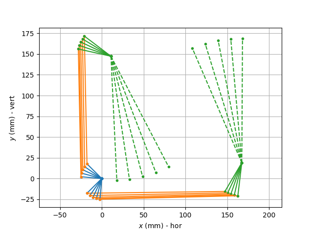

# Code for analyzing the mechanism of a ventilator
**Juan A. Ramírez Macías**  
*Mech. Eng. Professor*  
*Universidad Pontificia Bolivariana*

This repository code used for designing and analyzing a mechanical ventilator. The code is programmed using Python.

The files so far are:
- *vent_analysis_baseDesign.py:* the first code I made that analyses a base mechanism.
- *vent_analysis.py:* this code is more elaborated because it defines the mechanism as an object; it makes it more flexible.
- *vent_synthesis.py:* the first version of a code that may be used for designing a new mechanism.
- *vent_synthesis_v2.py:* a second version of the code where the two mechanisms are sinthesized simultaneously.
- *vent_newdesign_analysis.py:* a code for the analysis of the new design.

This is how the base mechanism looks like:

This is how a re-degigned mechanism may look like:
